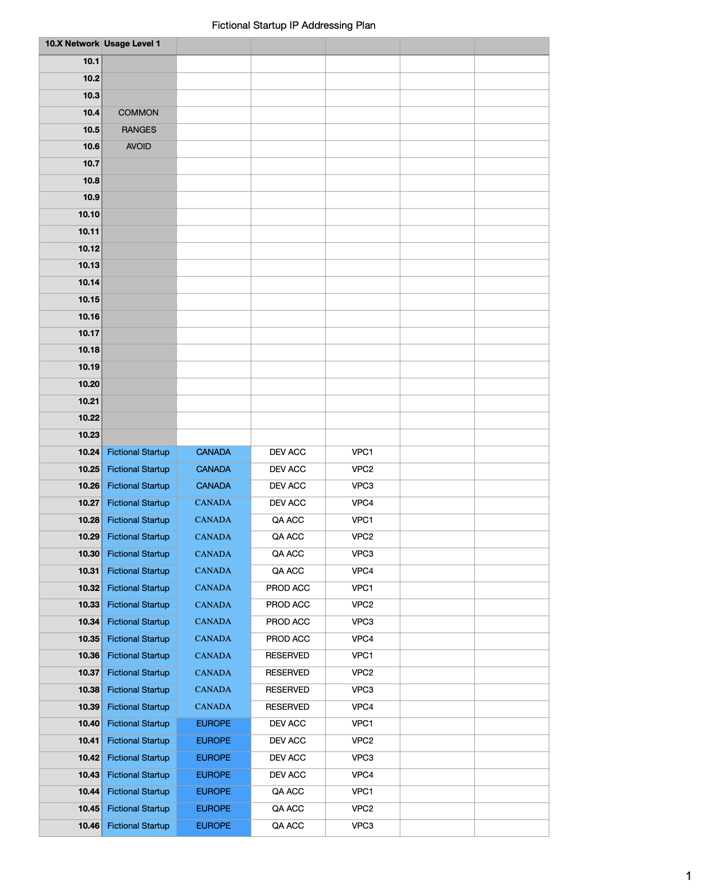
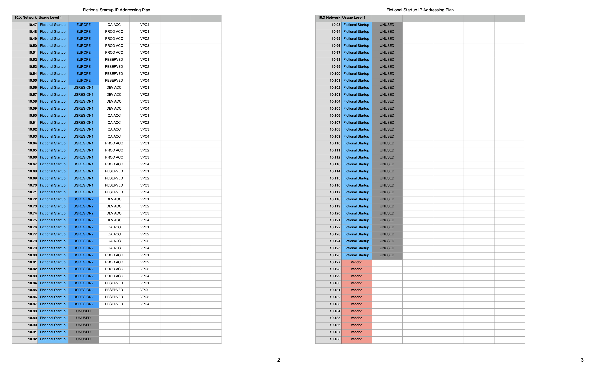
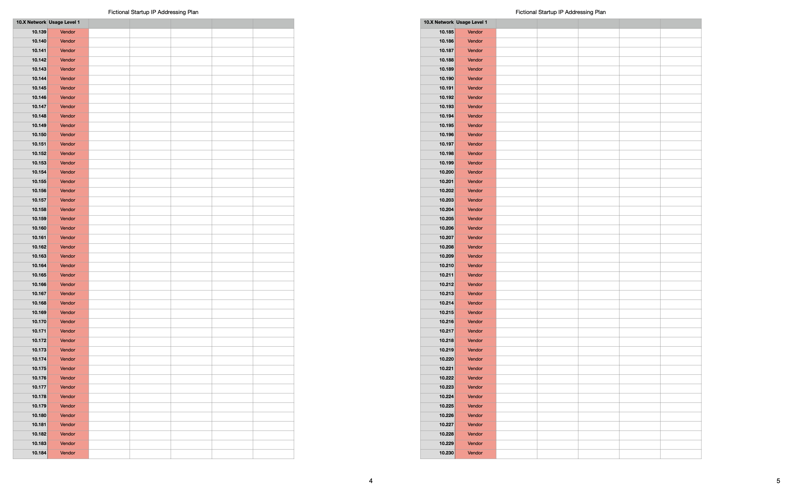
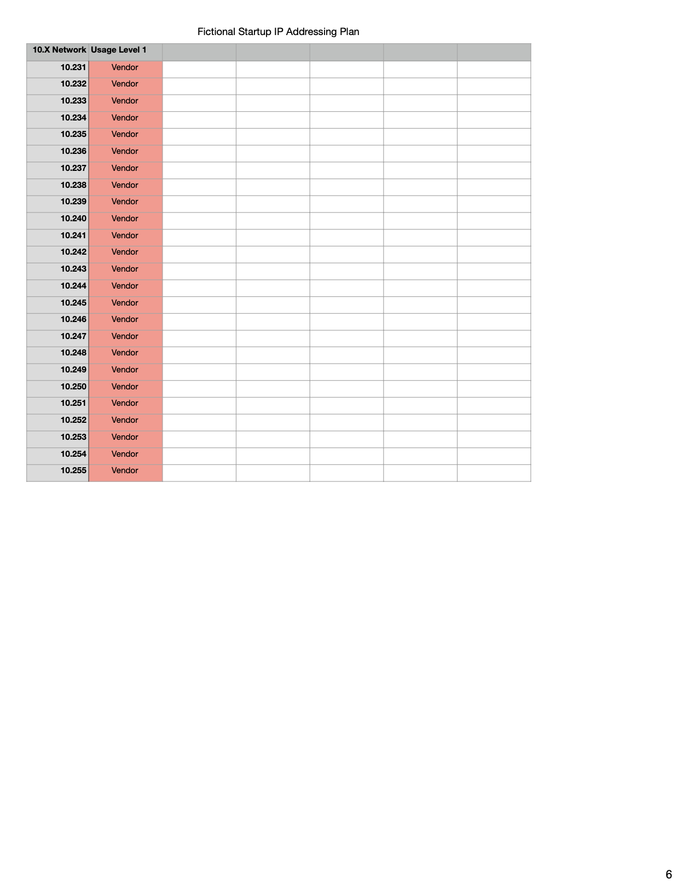

# Goal
This is an attempt to design a VPC (Virtual Private Cloud) in AWS for a fictional startup 

# Scenario
A fictional startup, xyz, that operates in Canada and Europe needs an IP Plan design to launch a set of services in AWS. The startup also plans to interact with a vendor's services which are in a Network Range of **10.127.0.0/9** which starts at **10.127.0.0** and ends at **10.255.255.255**

Given the Scenario above, let's kick-off the vpc design with a few Considerations before we start  our VPC Sizing:

# Considerations
- This startup would need a minimum of 2 IP Address Ranges, i.e 2 Network Ranges, for a global network, given the 2 locations it operates from.
- The Default VPC for AWS, which has a CIDR Range of **172.31.0.0/16**, should be avoided when picking a VPC CIDR range for this fictional startup for a production use case.
- We need to also avoid the range **10.127 to 10.255** because it is used by the fictional startup vendor.

# VPC Sizing
### Picking a Range
From the Private IP Address Space, let's start at **10.24**, which is an IP Range from the Class A Private Address Space, i.e 10.0.0.0 to 10.255.255.255. 
But remember we are going to avoid using the ranges **10.127 through to 10.255**, which is used by the startup vendor, to prevent services having issues in Network Communication. 
Services like web servers, api servers, etc are launced into a VPC - A Service is actually launched into a Subnet in a VPC. A Subnet resides in one AZ. But to add Resiliency to the Startup's Services, we need to launch them in Multiple AZs. So, we need to decide on the Number of AZs the VPC will use, which is highlighted below. 
 

### The Number of AZs the VPC will use
Let's start with 3 Avalaibity Zones and add a buffer to make it 4 i.e AZ-A, AZ-B, AZ-C and AZ-D. Keep in mind that the number of AZs in each Region varies and the typical number of AZs in a Region is 3. So, we would need to split the VPC into *4 smaller Networks (subnets)*.  
There is also a concept of Tiers within a VPC. An application can be logically divided in to Tiers like web tier, application tier, database tier, etc. A Service will belong to a Tier, each Tier will be in its own Subnet in each AZ. So, a Service will be in deployed in a Tier across Multiple AZs to achieve High Availability. 
 

### The Number of Tiers in a VPC
Let's go with 4 Tiers for Web, Application, Database and an extra tier for a buffer. This would further split the VPC into *4 * 4 i.e 16 smaller Networks (subnets)*. 
 

### AWS VPC Sizing
Based on [AWS VPC Sizing](https://d0.awsstatic.com/aws-answers/AWS_Single_VPC_Design.pdf) and our design so far, we will go with Extra Large VPC, which has **16** **_/20 Subnets each with 4091 IP Addresses_**.
 

### Network Segments per Regions
From th Scenario above, the business operates in 2 regions, i.e Canada and Europe. Let's add 2 regions in the U.S, as a buffer for growth, which makes it **4 regions**. So, we have
    - **1** region in Canada
    - **1** region in Europe
    - **2** regions in U.S  
So, if we start at **10.24**, and begin to create Network Segments of 16 Smaller Networks for each Region, we will have the below:
     - 10.24 to 10.39 for Canada
     - 10.40 to 10.55 for Europe
     - 10.56 to 10.71 for U.S region 1
     - 10.72 to 10.87 for U.S region 2 
 

### Network Segments per AWS Account 
Most organizations have multiple AWS Accounts for Security reasons. Based on this, let's have 4 AWS Accounts, i.e Dev, QA, Prod and 1 extra to serve as a buffer.   So, let's break down the Network Segments further for each AWS Account. When we further segment the Network Ranges per Region above, for each AWS Account, we have
    - 10.24 to 10.39 for Canada Region becomes:
        - 10.24 to 10.27 for Account 1 (DEV ACC)
        - 10.28 to 10.31 for Account 2 (QA ACC)
        - 10.32 to 10.35 for Account 3 (PROD ACC)
        - 10.36 to 10.39 for Account 4 (RESERVED)
    - 10.40 to 10.55 for Europe Region becomes:
        - 10.40 to 10.43 for Account 1 (DEV ACC)
        - 10.44 to 10.47 for Account 2 (QA ACC)
        - 10.48 to 10.51 for Account 3 (PROD ACC)
        - 10.52 to 10.55 for Account 4 (RESERVED)
    - 10.56 to 10.71 for U.S region 1 beocmes:
        - 10.56 to 10.59 for Account 1 (DEV ACC)
        - 10.60 to 10.63 for Account 2 (QA ACC)
        - 10.64 to 10.67 for Account 3 (PROD ACC)
        - 10.68 to 10.71 for Account 4 (RESERVED)
    - 10.72 to 10.87 for U.S region 2 becomes:
        - 10.72 to 10.75 for Account 1 (DEV ACC)
        - 10.76 to 10.79 for Account 2 (QA ACC)
        - 10.80 to 10.83 for Account 3 (PROD ACC)
        - 10.84 to 10.87 for Account 4 (RESERVED)
 

So, for each AWS Account, we have **4 VPC CIDR Ranges** in each of the **4 Regions** to deploy their Infrastructure into. This is more than enough as it takes into consideration future significant growth of this fictional startup.

# VPC Structure
[Download Fictional Startup IP Address Plan](/ip-plan/fictional-startup-ip-address.pdf). You can also see the Preview below.

